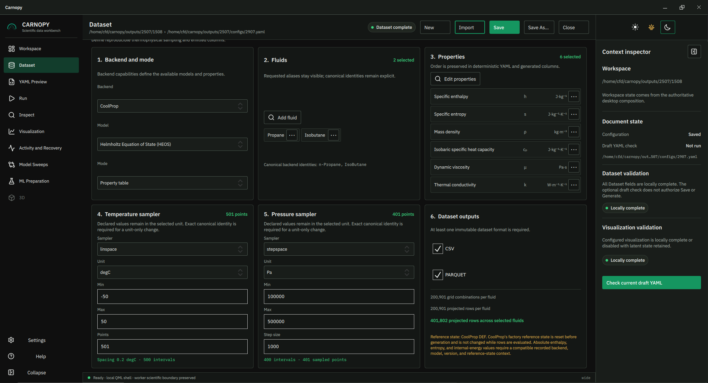
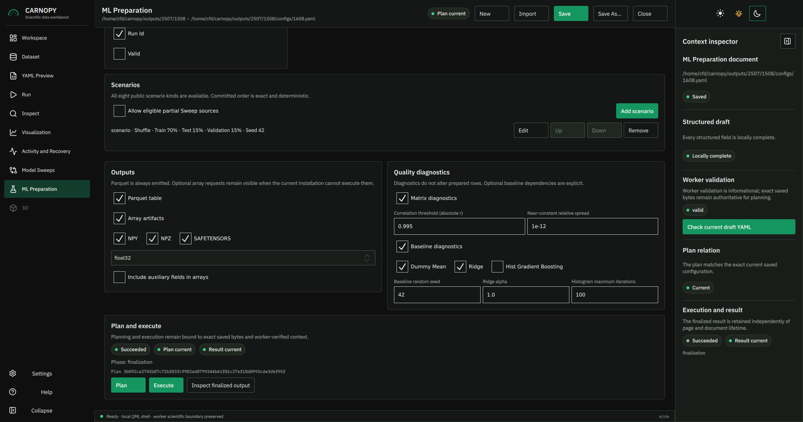

# Carnopy

[](https://pypi.org/project/carnopy/)
[](https://pypi.org/project/carnopy/)
[](https://github.com/gcalpay/carnopy/actions/workflows/ci.yml)
[](https://doi.org/10.5281/zenodo.22053741)
[](LICENSE)

Thermophysical data workbench for generating, importing, comparing, validating and visualizing data from experiments, literature, property models and simulation backends, with leakage-aware preparation for physics-informed machine learning.

Carnopy is an open and auditable thermophysical-data workbench. It turns an
explicit YAML sampling specification into immutable CSV and Parquet datasets,
diagnostics, metadata, and optional figures, with an automation-friendly CLI,
a Python library, and an optional QML desktop application.



> Carnopy is alpha software. Public interfaces and generated schemas may change
> before the stable `0.1.0` release.

## Core capabilities

- **Reproducible inputs:** explicit fluids, backend model, samplers, units,
  properties, and output formats.
- **Traceable outputs:** normalized configuration, software and backend
  versions, reference-state context, artifact hashes, and stable identities.
- **Explicit failures:** invalid thermodynamic states remain visible as
  row-level diagnostics instead of silently disappearing.
- **One scientific core:** CLI, Python, and desktop workflows use the same
  validation, generation, inspection, and rendering contracts.
- **Scientific visualization:** emitted states, gaps, phase changes, units,
  scales, legends, and figure provenance remain explicit rather than being
  silently repaired or invented.
- **ML-ready preparation:** deterministic leakage-aware partitions,
  transformations, diagnostics, and optional array exports without becoming a
  model-training framework.

Carnopy currently supports pure fluids through CoolProp, the HEOS, PR, and SRK
models, and three dataset modes:

| Mode | Generated states |
| --- | --- |
| `property_table` | Temperature-pressure state tables |
| `saturation_table` | Saturated-liquid and saturated-vapor endpoints |
| `vapor_mass_fraction_table` | Two-phase states over vapor mass fraction |

Carnopy is not a thermodynamic property model, experimental data,
backend-independent ground truth, or a process simulator. Generated values are
synthetic output from the selected backend and model.

## Installation

Carnopy requires Python 3.11 or later. Published packages, tagged source, and a
development checkout use separate installation paths.

### PyPI installation

Install the QML desktop workbench in an isolated uv-managed environment:

```bash
uv tool install "carnopy[app]==0.1.0a5"
carnopy-gui
```

Install the CLI and Python library into an existing virtual environment:

```bash
python -m pip install "carnopy==0.1.0a5"
carnopy --help
```

Optional capabilities use one extra on the same requirement:

| Extra | Adds |
| --- | --- |
| `app` | QML desktop workbench and plotting runtime |
| `viz` | Matplotlib plotting without the desktop UI |
| `ml` | SafeTensors preparation exports |
| `analysis` | Optional scikit-learn preparation diagnostics |
| `all` | Exact union of all public extras |

For example, use `carnopy[viz]==0.1.0a5` instead of `carnopy==0.1.0a5` when a
CLI or library environment also needs plotting. PyArrow remains a core
dependency because Parquet is a first-class output format.

`carnopy-gui` is the canonical desktop command. `carnopy-app` is a
compatibility alias that launches the same QML application.

### Installation from source

Run the tagged release without installing contributor tooling:

```bash
git clone --branch v0.1.0a5 --depth 1 https://github.com/gcalpay/carnopy.git
cd carnopy
uv sync --locked --extra app --no-dev
uv run --locked carnopy-gui
```

### Development setup

Clone the active repository and install the development environment:

```bash
git clone https://github.com/gcalpay/carnopy.git
cd carnopy
uv sync --locked --extra all --group dev --group release
uv run --locked pytest
```

`pyproject.toml` and `uv.lock` are authoritative. Do not create parallel
requirements files.

The desktop extra requires PySide6 Essentials 6.11.1 or later within the 6.11
release line. The private native bridge remains qualified against exactly Qt
6.11.1. Qt is an optional third-party dependency with its own licensing terms;
Carnopy remains MIT licensed and does not ship a standalone Qt installer.

## Quick start

Create, inspect, and visualize a property-table dataset:

```bash
carnopy init property_table my-dataset.yaml
# Review or edit the generated YAML.
carnopy generate my-dataset.yaml
carnopy inspect outputs/<run>
carnopy plot outputs/<run> \
  --kind property-curves \
  --property mass_density \
  --x temperature
```

The normal command-line workflow is:

```text
init -> edit -> optional validate -> generate/sweep -> inspect -> optional plot -> optional prepare
```

`generate` always performs authoritative validation. The separate `validate`
command is useful for scripts and early feedback, but it does not evaluate
thermodynamic rows or authorize a later generation.

Use command-specific help for the complete current interface:

```bash
carnopy --help
carnopy init --help
carnopy generate --help
carnopy sweep --help
carnopy inspect --help
carnopy plot --help
carnopy prepare --help
```

## Desktop workflow

Start the workbench with:

```bash
carnopy-gui
```

The primary desktop workflow is:

```text
Workspace -> Dataset -> Save -> Run -> Generate
                                   |-> Create plot from this run -> Visualization -> Render plot
                                   |-> Inspect data -> ML Preparation -> Plan -> Execute
                    |-> optional YAML Preview

Workspace -> Model Sweeps -> Plan -> Execute -> Inspect
```

Dataset supports property, saturation, and vapor-mass-fraction tables. Run
generates an exact clean saved configuration. A successful run can be inspected,
used for ML Preparation, or passed directly to Visualization as a compatible
editable plot request. Rendering, planning, and execution remain explicit user
actions.

YAML Preview exposes the complete deterministic document. Activity and Recovery
provides request history and explicit recovery of selected staging artifacts.

Scientific generation, inspection, and Matplotlib rendering run in short-lived
workers. The QML process does not import CoolProp, NumPy, pandas, PyArrow, or
Matplotlib. PNG and SVG use hash-bound in-app previews; PDF opens only after an
explicit revalidation and user action.

To preselect a workspace:

```bash
carnopy-gui --workspace /path/to/workspace
```

Each workspace keeps YAML configurations in `configs/`, immutable generated
runs in `outputs/`, and rendered plots in `figures/`. Opening or importing a
configuration starts in that workspace's `configs/` folder.

Qt normally detects its platform integration. On WSLg, Carnopy's `auto` mode
prefers XCB when both display transports are available because native Wayland
dialogs can detach after selection. Override it only when necessary:

```bash
carnopy-gui --qt-platform xcb --workspace /path/to/workspace
```

## Configuration at a glance

Carnopy dataset configurations use YAML schema version 2:

```yaml
schema_version: 2
document_type: dataset
backend:
  name: coolprop
  model: heos
mode: property_table
fluids: [Propane, Isobutane]

grid:
  temperature:
    kind: linspace
    start: -50
    stop: 50
    num: 101
    unit: degC
  pressure:
    kind: linspace
    start: 101325
    stop: 506625
    num: 41
    unit: Pa

properties:
  - specific_enthalpy
  - mass_density

outputs:
  dataset_formats: [csv, parquet]

# Optional: render this figure during Generate.
visualization:
  format: png
  fluids: [Propane]
  display_units:
    temperature: degC
    pressure: bar
  plots:
    - name: propane-density-map
      kind: property_heatmap
      property: mass_density
```

Remove the optional `visualization` section for a dataset-only run. Configured
figures require the `viz`, `app`, or `all` extra and are written outside the
immutable dataset run with plot provenance and a visualization report.

Create a concise starter or the exhaustive commented reference:

```bash
carnopy init property_table my-dataset.yaml
carnopy init property_table full-reference.yaml --full
```

Supported public samplers are `explicit`, `linspace`, `stepspace`,
`geomspace`, and `logspace`. Supported input units are:

| Coordinate | Units |
| --- | --- |
| Temperature | `K`, `degC` |
| Pressure | `Pa`, `hPa`, `kPa`, `MPa`, `bar`, `atm` |
| Vapor mass fraction | `1` |

All backend calls and generated numeric columns use SI. Carnopy preserves the
declared units and sampler definitions in provenance while normalizing the
executable scientific specification deterministically.

HEOS is the starter default, not experimental truth. PR and SRK are alternative
model assumptions, not accuracy rankings, and do not provide transport
properties, surface tension, or a usable triple point. Model selection changes
scientific identity and is recorded in rows, metadata, and reports.

## Outputs and provenance

Each immutable dataset run contains selected table files plus mandatory
provenance:

```text
outputs/<run>/
├── dataset.csv              # when requested
├── dataset.parquet          # when requested
├── config.original.yaml
├── config.normalized.json
├── config.reference.yaml
├── metadata.json
└── report.json
```

Runs are staged and then atomically renamed. Existing final or staging paths
are never overwritten. The executable specification, generation context,
output request, execution attempt, visualization request, and exact artifact
bytes retain distinct identities.

Metadata records software and backend versions, selected model, CoolProp `DEF`
reference-state policy, canonical fluids and properties, sampling, failures,
units, constants, and artifact hashes. Failed states remain rows with stable
failure fields and preserved backend diagnostics.

## Visualization

Visualization reads emitted columns only. It never calls a thermodynamic
backend, smooths, interpolates, extrapolates, or invents states.

Supported plot kinds are property curves, sampled property heatmaps, generic
X-Y plots, and emitted-state p-v and T-s diagrams.

Exact filters and series values never select a nearest neighbor. The p-v plot
derives only `specific_volume = 1 / mass_density`; the T-s plot uses emitted
temperature and specific entropy. Neither constructs a cycle, process path,
phase envelope, saturation dome, or missing branch.

The optional YAML visualization section renders PNG, SVG, or PDF figures only
during a later Generate. It does not alter an existing run.

In the desktop workbench, **Create plot from this run** inspects the exact
finalized output and opens an editable session-only request. The request uses a
compatible plot kind, property, axes, and fluids, with PNG as the default. It
does not render until **Render plot** is pressed. Session plotting does not
change the saved YAML or affect the generated dataset. Automated YAML plots
remain available separately and render only during a later Generate.

## Model sweeps and ML Preparation

### Model sweeps

Model sweeps generate ordinary immutable child runs and compare their emitted
values without extra thermodynamic evaluation during comparison:

```bash
carnopy init model_sweep sweep.yaml
carnopy sweep sweep.yaml
```

In the desktop workbench, create or open that YAML through Workspace and use
**Model Sweeps** for structured editing, planning, controlled execution,
cancellation, result review, and Inspect handoff.

### ML Preparation



Preparation reads an existing immutable run or sweep bundle and never calls a
thermodynamic backend:

```bash
carnopy init preparation preparation.yaml
carnopy prepare outputs/<run> --config preparation.yaml --out prepared
```

In the desktop workbench, bind an eligible source explicitly from Inspect, then
use **ML Preparation** for structured editing, planning, controlled execution,
cancellation, result review, and inspection of the finalized audit evidence.

Parquet remains the canonical prepared table. Optional NumPy and SafeTensors
files are derived ML-consumption exports. Leakage-aware scenarios keep an exact
thermodynamic-state hash in one partition, and transformations fit on training
data only. Optional scikit-learn baselines are disposable diagnostics; Carnopy
does not train, tune, register, or deploy production models.

Implemented behavior and reviewed research directions are separated in the
[ML preparation roadmap](ML_PREPARATION_ROADMAP.md).

## Python API

The public API intentionally remains narrow:

```python
from carnopy import generate_dataset, load_config, validate_config

loaded = load_config("my-dataset.yaml")
validation = validate_config("my-dataset.yaml")
result = generate_dataset(
    "my-dataset.yaml",
    output_root="outputs",
    figures_root="figures",
)
```

Public helpers also cover model sweeps, preparation, and explicit
visualization. CLI handlers and desktop controllers call the same core logic
rather than maintaining separate scientific implementations.

## Current alpha scope

Carnopy `0.1.0a5` deliberately begins with a bounded, verified scientific
scope. The current alpha supports CoolProp pure fluids with HEOS,
Peng-Robinson, and Soave-Redlich-Kwong; three dataset modes; model sweeps;
emitted-column visualization; and leakage-aware ML Preparation. These are
current release boundaries, not the intended limit of the project.

- Generated data is backend output, not experimental evidence.
- Specific enthalpy, entropy, and internal energy depend on reference state.
- Carnopy resets every requested fluid to CoolProp `DEF` before generation and
  records that policy.
- Absolute reference-dependent values are not directly comparable across
  incompatible model/reference contexts.
- PR/SRK transport properties, surface tension, and triple-point temperature
  are rejected because the cubic backends do not provide the required
  capability.
- ML training, model hyperparameter sweeps, GPU orchestration, checkpoints, and
  deployment are outside Carnopy core.
- Mixtures, additional property backends, validated reference-data imports,
  thermodynamic-cycle simulation, native 3D, web services, databases, and
  standalone desktop installers are not implemented in this alpha.

See the official [CoolProp documentation](https://coolprop.org/coolprop/) and
[high-level API reference](https://coolprop.org/coolprop/HighLevelAPI.html) for
backend behavior.

## Future Scope

Carnopy's current contracts remain intentionally narrower than its planned
direction:

```text
thermophysical engines and data sources
  -> Carnopy configuration, generation/import, comparison, inspection,
     visualization, preparation, export, and audit
  -> reproducible bundles and adapters
  -> external model-training frameworks and applications
```

The planned direction develops six connected capabilities:

- **Validated sources and comparisons:** import reference and experimental data,
  beginning with ThermoML-compatible records, while preserving citations,
  methods, units, uncertainty, composition, and validity domains.
- **Mixtures and phase equilibria:** begin with binary mixtures through a data
  contract that can extend to multicomponent compositions, flashes, phase
  envelopes, and equilibrium data without changing scientific identity rules.
- **Additional models and backends:** evaluate established model families such
  as NRTL, UNIQUAC, UNIFAC, PC-SAFT, CPA, Lee-Kesler, GERG, IAPWS, and Pitzer
  through narrowly qualified backend adapters rather than reimplementing them.
- **Thermodynamic-cycle studies:** integrate simulation engines for Rankine and
  organic Rankine cycles, refrigeration, heat pumps, and Brayton cycles while
  retaining exact topology, assumptions, balances, solver evidence, and
  provenance.
- **Expanded visualization:** add mixture, phase-equilibrium, model-comparison,
  uncertainty, cycle, Preparation, and imported ML-result views backed only by
  verified data contracts; extend exact emitted-value 3D with CAD-style
  orbit, pan, zoom, standard and isometric views, scalar coloring, exact point
  inspection, and selectable X/Y/Z/color projections of multidimensional data.
- **ML interoperability:** keep Parquet canonical while evaluating PyTorch and
  selected external physics-informed and tabular-ML consumers, plus an
  identity-bound result-import contract for prediction and error analysis.

Reference-dependent enthalpy, entropy, and internal-energy values remain tied
to their recorded source, model, and reference-state context. Future comparison
work will preserve raw values, make compatibility explicit, and allow only
documented, reversible alignment against a declared anchor rather than silent
normalization.

The [thermophysical and simulation roadmap](THERMOPHYSICAL_ROADMAP.md) records
the detailed source, model, backend, mixture, cycle, and visualization
candidates. The [ML preparation roadmap](ML_PREPARATION_ROADMAP.md) records
framework interoperability and result-evaluation directions. Roadmap entries
are research and planning candidates, not support promises; each requires a
separately reviewed scientific contract, implementation plan, and qualification
before it changes public behavior.

## Contributing

Carnopy uses a `src/` layout, Hatchling, uv, Ruff, strict mypy, and pytest.
`pyproject.toml` and `uv.lock` are authoritative.

Read [CONTRIBUTING.md](https://github.com/gcalpay/carnopy/blob/main/.github/CONTRIBUTING.md)
before proposing a public or scientific contract change. Use
[GitHub Issues](https://github.com/gcalpay/carnopy/issues) for reproducible bugs,
scientific discrepancies, and focused feature requests. Report vulnerabilities
privately through the [security policy](https://github.com/gcalpay/carnopy/security/policy).

The implemented desktop ownership and worker boundary are documented in
[DESKTOP_ARCHITECTURE.md](https://github.com/gcalpay/carnopy/blob/main/DESKTOP_ARCHITECTURE.md).

## Release status

The current alpha release is `0.1.0a5`. It includes the structured Model Sweep
and ML Preparation desktop workflows, direct post-generation plotting, the
custom desktop window frame, and the associated lifecycle and release
qualification work. See the
[v0.1.0a5 release notes](https://github.com/gcalpay/carnopy/blob/main/docs/releases/v0.1.0a5.md)
for a concise summary.

The version-specific archive is available from Zenodo under
[DOI 10.5281/zenodo.22053741](https://doi.org/10.5281/zenodo.22053741).

## License

Carnopy is distributed under the [MIT License](LICENSE).
